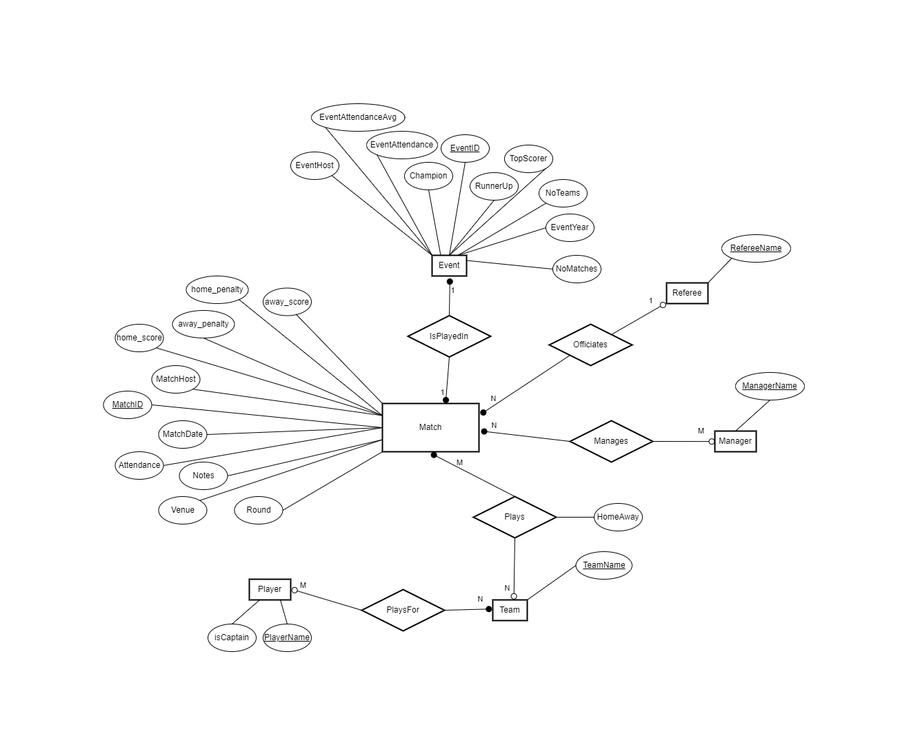

# Database Design and Implementation Report

## Cover Page

### Final Assessment: Database System for FIFA Women's World Cup
#### Student Name: Ryan Mackintosh
#### Student ID: 21171466
#### Lab Group: Thursday 8am

## Table of Contents

- [Introduction](#introduction)
- [Design of the Database](#design-of-the-database)
  - [Entity Selection](#entity-selection)
  - [ER Diagram](#er-diagram)
  - [Relational Schema](#relational-schema)
  - [Data Description](#data-description)
  - [Assumptions](#assumptions)
- [Implementation of the Database and Adding Sample Data](#implementation-of-the-database-and-adding-sample-data)
  - [Database Implementation](#database-implementation)
  - [Sample Data and Insertion](#sample-data-and-insertion)
- [Use of the Database](#use-of-the-database)
  - [Queries](#queries)
  - [Advanced Features](#advanced-features)
  - [Database Connectivity and Python Implementation](#database-connectivity-and-python-implementation)
- [Discussion](#discussion)
- [References](#references)

## Introduction

_Brief overview of the work done, the selected scenario, and activities undertaken._

## Design of the Database

### Entity Selection

_Explanation of the selected entities, relationships, data types, etc._
##### Entity Sets, Relationship Sets, and Cardinality Constraints

**Entity Set**
| Entity Set   | Key         | Other Attributes                                                                                      | Relationship Set | Between Entity Sets | Attributes | Relationship Set Cardinality | Participation / Other Constraints                      |
|--------------|-------------|-------------------------------------------------------------------------------------------------------|------------------|---------------------|------------|-----------------------------|--------------------------------------------------------|
| Match        | MatchID     | home_score, away_score, home_penalty, away_penalty, Attendance, Venue, Round, MatchDate, Notes, MatchHost | Is Played In     | Match-Event         | EventID    | Many-One                    | Each Match is associated with one Event; An Event can have multiple Matches |
| Team         | TeamName    |                                                                                                       | Plays            | Match-Team          | MatchID, HomeAway | Many-Many                | A Team can play in many Matches; A Match involves two Teams |
| Player       | PlayerName  | isCaptain                                                                                             | PlaysFor                 | Player-Team                    | PlayerName, TeamName           | Many-Many                             | Many Players can play for a Team; A Team has many Players                                                          |
| Event        | EventID     | EventYear, EventHost, NoTeams, Champion, RunnerUp, TopScorer, EventAttendance, EventAttendanceAvg, NoMatches | Is Played In     | Match-Event         | MatchID    | Many-One                    | Each Match is associated with one Event; An Event can have multiple Matches |
| Manager      | ManagerName |                                                                                                       | Manages          | Match-Manager       | MatchID    | Many-Many                    | A Manager can manage in many Matches; A Match can have multiple Managers |
| Referee      | RefereeName |                                                                                                       | Officiates       | Match-Referee       | MatchID    | Many-One                    | A Referee can officiate many Matches; A Match is officiated by one Referee |

**Relationship Set**
| Relationship Set | Between Entity Sets | Attributes | Relationship Set Cardinality | Participation / Other Constraints |
|------------------|---------------------|------------|-----------------------------|--------------------------------------------------------|
| Plays            | Match-Team          | MatchID, TeamName, HomeAway | Many-Many                | A Team can play in many Matches; A Match involves two Teams |
| Manages          | Match-Manager       | MatchID, ManagerName | Many-Many                    | A Manager can manage in many Matches; A Match can have multiple Managers |
| Officiates       | Match-Referee       | MatchID, RefereeName | Many-One                    | A Referee can officiate many Matches; A Match is officiated by one Referee |
| Is Played In     | Match-Event         | MatchID, EventID | Many-One                    | Each Match is associated with one Event; An Event can have multiple Matches |

### ER Diagram



### Relational Schema

#### Entity Sets

##### FootballMatch
```
FootballMatch(MatchID, home_score, away_score, home_penalty, away_penalty, Attendance, Venue, Round, MatchDate, Notes, MatchHost, EventID, RefereeName)
FK EventID REF Event(EventID)
FK RefereeName REF Referee(RefereeName)
```

##### Team
```
Team(TeamName)
```

##### Player
```
Player(PlayerName, isCaptain)
```

##### Manager
```
Manager(ManagerName)
```

##### Referee
```
Referee(RefereeName)
```

##### Event
```
Event(EventID, EventYear, EventHost, NoTeams, Champion, RunnerUp, TopScorer, EventAttendance, EventAttendanceAvg, NoMatches)
```

#### Relationship Sets (Represented as Tables for Many-to-Many Relationships)

##### Plays
```
Plays(MatchID, TeamName, HomeAway)
FK MatchID REF FootballMatch(MatchID)
FK TeamName REF Team(TeamName)
```

##### Manages
```
Manages(MatchID, ManagerName)
FK MatchID REF FootballMatch(MatchID)
FK ManagerName REF Manager(ManagerName)
```

##### PlaysFor
```
PlaysFor(PlayerName, TeamName)
FK PlayerName REF Player(PlayerName)
FK TeamName REF Team(TeamName)
```

### Data Description

#### FootballMatch

| Attribute    | Data Type    | Constraints | Description                               | Business Rules                                         |
|--------------|--------------|-------------|-------------------------------------------|--------------------------------------------------------|
| MatchID      | INT          | PK, NOT NULL, UNIQUE | Unique identifier for each match       | Must be unique                                         |
| home_score   | INT          |             | Score of the home team                    | Can be null if match hasn't been played yet            |
| away_score   | INT          |             | Score of the away team                    | Can be null if match hasn't been played yet            |
| home_penalty | INT          |             | Penalty score of the home team            | Can be null if match hasn't gone to penalties          |
| away_penalty | INT          |             | Penalty score of the away team            | Can be null if match hasn't gone to penalties          |
| Attendance   | INT          |             | Number of attendees at the match          | Can be null if match hasn't been played yet            |
| Venue        | VARCHAR(255) |             | Location where the match is played        | Can be null if venue is not decided yet                |
| Round        | VARCHAR(50)  |             | Stage of the competition                  | Can be null if not applicable                          |
| MatchDate    | DATE         |             | Date when the match is played             | Can be null if date is not decided yet                 |
| Notes        | TEXT         |             | Additional notes about the match          | Can be null                                            |
| MatchHost    | VARCHAR(255) |             | Host country or city of the match         | Can be null if not applicable                          |
| EventID      | INT          | FK referencing Event(EventID), ON DELETE CASCADE, ON UPDATE CASCADE | ID of the event the match is part of | Must correspond to an existing EventID                |
| RefereeName  | VARCHAR(255) | FK referencing Referee(RefereeName), ON DELETE SET NULL, ON UPDATE CASCADE | Name of the referee officiating the match | Can be null if referee is not decided yet, must correspond to an existing RefereeName |

#### Team

| Attribute | Data Type    | Constraints | Description               | Business Rules |
|-----------|--------------|-------------|---------------------------|----------------|
| TeamName  | VARCHAR(255) | PK, NOT NULL, UNIQUE | Name of the football team | Must be unique |

#### Player

| Attribute  | Data Type | Constraints | Description               | Business Rules                         |
|------------|-----------|-------------|---------------------------|----------------------------------------|
| PlayerName | VARCHAR(255) | PK, NOT NULL, UNIQUE | Name of the player      | Must be unique                         |
| isCaptain  | BOOLEAN   | DEFAULT FALSE | Indicates if player is captain | Only 1 captain per team per event |

#### Event

| Attribute         | Data Type    | Constraints | Description                           | Business Rules |
|-------------------|--------------|-------------|---------------------------------------|----------------|
| EventID           | INT          | PK, NOT NULL, UNIQUE | Unique identifier for each event   | Must be unique |
| EventYear         | YEAR         |             | Year when the event took place        | Can be null if event is planned for future |
| EventHost         | VARCHAR(255) |             | Host country or city of the event     | Can be null if not applicable |
| NoTeams           | INT          |             | Number of teams participating         | Can be null if not decided yet |
| Champion          | VARCHAR(255) |             | Winning team of the event             | Can be null if event hasn't concluded yet |
| RunnerUp          | VARCHAR(255) |             | Runner-up team of the event           | Can be null if event hasn't concluded yet |
| TopScorer         | VARCHAR(255) |             | Top scorer of the event               | Can be null if event hasn't concluded yet |
| EventAttendance   | INT          |             | Total attendance throughout the event | Can be null if event hasn't concluded yet |
| EventAttendanceAvg| FLOAT        |             | Average attendance per match          | Can be null if event hasn't concluded yet |
| NoMatches         | INT          |             | Number of matches in the event        | Can be null if not decided yet |

#### Manager

| Attribute   | Data Type    | Constraints | Description             | Business Rules |
|-------------|--------------|-------------|-------------------------|----------------|
| ManagerName | VARCHAR(255) | PK, NOT NULL, UNIQUE | Name of the manager | Must be unique |

#### Referee

| Attribute   | Data Type    | Constraints | Description             | Business Rules |
|-------------|--------------|-------------|-------------------------|----------------|
| RefereeName | VARCHAR(255) | PK, NOT NULL, UNIQUE | Name of the referee | Must be unique |

#### Plays (Many-to-Many Relationship)

| Attribute | Data Type    | Constraints | Description             | Business Rules |
|-----------|--------------|-------------|-------------------------|----------------|
| MatchID   | INT          | FK referencing FootballMatch(MatchID), ON DELETE CASCADE, ON UPDATE CASCADE | ID of the match | Must correspond to an existing MatchID |
| TeamName  | VARCHAR(255) | FK referencing Team(TeamName), ON DELETE CASCADE, ON UPDATE CASCADE | Name of the team | Must correspond to an existing TeamName |
| HomeAway  | ENUM('Home', 'Away') | NOT NULL | Indicates if the team is playing at home or away | Must be 'Home' or 'Away' |

#### Manages (Many-to-Many Relationship)

| Attribute   | Data Type    | Constraints | Description             | Business Rules |
|-------------|--------------|-------------|-------------------------|----------------|
| MatchID     | INT          | FK referencing FootballMatch(MatchID), ON DELETE CASCADE, ON UPDATE CASCADE | ID of the match | Must correspond to an existing MatchID |
| ManagerName | VARCHAR(255) | FK referencing Manager(ManagerName), ON DELETE CASCADE, ON UPDATE CASCADE | Name of the manager | Must correspond to an existing ManagerName |

#### PlaysFor (Many-to-Many Relationship)

| Attribute   | Data Type    | Constraints | Description             | Business Rules |
|-------------|--------------|-------------|-------------------------|----------------|
| PlayerName     | VARCHAR(255)          | FK referencing Player(PlayerName), ON DELETE CASCADE, ON UPDATE CASCADE | Name of the player | Must correspond to an existing PlayerName |
| TeamName | VARCHAR(255) | FK referencing Team(TeamName), ON DELETE CASCADE, ON UPDATE CASCADE | Name of the team | Must correspond to an existing TeamName |

### Third Normal Form

Normalization is a systematic approach of decomposing tables to eliminate data redundancy and undesirable characteristics like Insertion, Update, and Deletion Anomalies. It's a multi-step process that puts data into tabular form by removing duplicated data from the relation tables.

#### First Normal Form (1NF)
For a table to be in 1NF, it must have:
1. No repeating groups or arrays.
2. All values must be atomic (indivisible).

My Schema:
- Each attribute has atomic values (no multi-valued attributes).
- There are no repeating groups; for example, `Plays` and `Manages` are separate tables, which indicates that many-to-many relationships are handled properly.

#### Second Normal Form (2NF)
For a table to be in 2NF, it must be in 1NF, and:
1. All non-key attributes must be fully functionally dependent on the primary key.

2NF only applies to tables with composite primary keys (primary keys consisting of more than one attribute):
- `Plays` and `Manages` have composite keys (`MatchID` and `TeamName` for `Plays`; `MatchID` and `ManagerName` for `Manages`). In these tables, all non-key attributes are fully dependent on the full set of key attributes.

#### Third Normal Form (3NF)
For a table to be in 3NF, it must be in 2NF, and:
1. It has no transitive dependencies; that is, no non-key attribute depends on another non-key attribute.

My Schema:
- `FootballMatch` has foreign keys (`EventID`, `RefereeName`) that reference primary keys in other tables (`Event`, `Referee`). There are no attributes in `FootballMatch` that are non-key and depend on other non-key attributes.
- `Event` has attributes like `Champion`, `RunnerUp`, and `TopScorer`, which are dependent on `EventID` and not on any other non-key attribute.
- `Plays` and `Manages` do not have non-key attributes that depend on other non-key attributes.

All tables are in 3NF because each table has a primary key that uniquely identifies its rows, and there are no attributes that are dependent on non-key attributes, which eliminates transitive dependencies.

### Assumptions

_Any assumptions made during the design of the database._

## Implementation of the Database and Adding Sample Data

### Database Implementation

_Description of the steps taken to implement the database with evidence._

### Sample Data and Insertion

_Description of the sample data, data sources, and the process of inserting data into the database._

## Use of the Database

### Queries

_Design and implementation of queries with explanations and sample outputs._

### Advanced Features

_Description of advanced features implemented, their use, and evidence of outputs._

### Database Connectivity and Python Implementation

_Description of the database connectivity implementation with evidence._

## Discussion

_Reflection on the work done, achievements, challenges faced, limitations, and potential improvements._

## References

_Report References_
_Code References_

## Appendices

_Any appendices go here_

## Pun for good measure

I watched a movie about databases today and now I can't wait for the SQL!

P.S Thanks for a good semester :)